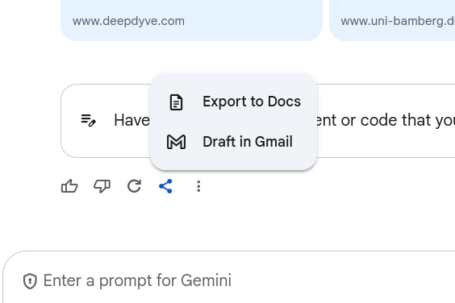

[As everyone is aware](https://nymag.com/intelligencer/article/openai-chatgpt-ai-cheating-education-college-students-school.html), Large Language Models (LLMs) are *disrupting* higher education. There are a lot of proposed solutions, almost all of them that require radically reshaping higher education. This post is not another one of those solutions. Instead, it is an example of something small I did this year that I think helped in one course for one assignment. As much as I think it is worthwhile to talk about big changes, I hope that a discussion of small changes can help ease some of the existential dread educators feel right now. 

::: {.callout-tip title="TL;DR"}
I reversed one of my writing assignments. I had students use Google Gemini to write one of their papers and then their task was to evaluate the sourcing (with evidence) and rewrite the paper. I did this because I realized that what I wanted them to learn in this course was how to evaluate sources, and how they are used. I'll probably do this again in the future, but will likely do more scaffolding. [The full text of the assignment is here.](#complete-assignment-instructions)
:::

## The Problem 

Since ChatGPT, and its many clones, took off several years ago I've found myself consistently reading essays that did not *feel right*. Some of this was a result of students using ChatGPT, while I know some of this was also a result of my dread that every student was using ChatGPT. I mainly tried to ignore this feeling. I changed my rubrics slightly, putting more emphasis on supporting specific claims but as LLMs improved it became clear to me that something was breaking. 

This last semester I was part of the [Howe Center for Writing Excellence's](https://miamioh.edu/howe-center/hwac/index.html) AI-Informed Pedagogy Program which gave me time to think and a group of people to think with. This conversation centered my focus on what the learning objectives are for my courses. Right now, I teach two types of courses, either data analytics courses or "middle level" substantive courses. This semester the latter was a course on [social movements and protest](../teaching/index.qmd#pol-345u-social-movements-and-protest). Although I think writing is important in the learning process, this is not a course designed to teach how to write. Instead I wanted students to learn theories of movement mobilizations and how to think about the evidence that supported those theories. 

In my pre-LLM days (which in all honesty I have limited experience with as a teacher), the purpose of an essay was to have students complete their own research, extending what we did in class. Yes, the final product was important, but also the process of creating that final product was important. LLMs potentially robbed students of the process and so I spent time thinking about how to recreate that process in a way where I could evaluate students more directly on the process of researching sources. 

## The Assignment 

For my social movement course, students select a movement to study throughout the semester. They turn in several assignments based on their movement: a timeline of the movement; an argument over when/where the movement was most active and its impacts; a summary of a social movement theory and a hypothesis; and finally a paper putting these pieces together. Historically the third part was the most susceptible to an LLM and often the results were sub-optimal for students that did it themselves. The sources they would find would come from strange places, and not help them in explaining their theory and its implications.  

Given this I took apart the assignment and created something that emphasized the research part. The basics of the new assignment were: 

1) The student would first use Google Gemini to generate a summary of a social movement theory with academic sources and a hypothesis about their movement
2) The students would select four sources that Google Gemini used. They would identify the claim(s) that Google Gemini made using the sources, and then research those sources to see if the sources accurately supported the claim. 
3) As part of their research they would take screenshots of the passages within the source that supported the claim. If the claim was entirely off base they would take screenshots to support their own summary of the source. 
4) They then wrote evaluations of how well Gemini used each of the sources they selected. 
5) Finally, they would rewrite the summary using just the sources they researched as well as an overall reflection on the assignment (partially because this was the first time I did this assignment). 

### Complete Assignment Instructions:

For anyone looking for the gritty details here is the assignment in full. As you can see, I probably over explain. There was also a rubric, though much of that recreates the details here. 

:::{.long-quote}

#### Assignment Goals/Explanation

For this assignment we are going to embrace using AI to see its strengths and weaknesses. While also helping you practice your ability to do research, even while relying on AI. I am hoping that by doing this assignment you'll be able to think better about a social movement theory, your movement, and how AI might be used. If you don't want to use AI at all for whatever reason talk to me, and we'll find an alternative version of this.

#### Assignment Process

You will follow a fours step process in writing this assignment.

1) Have Google Gemini write out an explanation of a social movement theory and apply it to your movement.
2) Go and double check the sources provided.
3) Write your own version of this based on the sources you've double checked only.
4) Reflect on this whole process

You will document this entire process and turn in all the different steps.

##### Google Gemini Version

Since Miami is a Google campus we all have access to Google Gemini which you can access at https://gemini.google.com

Links to an external site.. You will select a theory (framing, resource mobilization, political opportunity, or strain/deprivation) and enter the following prompt (replacing things as necessary). You should submit it as one prompt (not two).

> I need you to write a summary of the {THEORY} theory as used to explain the mobilization and demobilization of social movements. Use citations from at least 10 scholarly sources. 
>
> Then provide a hypothesis based on {THEORY} theory that explains the mobilization of the {MOVEMENT} movement. Identify how you would measure the dependent and independent variable. 

At the very bottom of the output there is an option to export this to a Google Doc:

{fig-align="center" width="50%"}

Select this so you have saved the document. You will submit this.

##### Researching Sources

Read through the output and select 4 sources to "check." Start a new Google Doc (or Word if you prefer) and create four sections. For each of these sources do the following:

1) Identify in the Gemini output what claim they are using the source to support (there might be multiple claims). For each claim you need to write out a sentence or two explaining it.
2) Now you need to go find the source and read it. 
3) When you find the source doing what Google Gemini claims it is doing, highlight that section of the text and take a screenshot of it. You'll then include that screenshot in your Google Doc. If you only take screenshots from abstracts or intros you will receive partial credit. You need to provide evidence that you've read the document. If it is a physical book then you can take a photo with your phone. Don't worry about highlighting it (unless you own the book).
4) Finally write a paragraph explaining how well you think the Google Gemini output uses the source. Are there important details that would change the interpretation? If the information Gemini used is not in the source then explain what the source says instead (and provide screenshots to support this).

If you cannot find the source at all then just write down "Source does not exist" and include a different source from Google Gemini (if you cannot find 4 real sources then come talk to me). 

##### Your Version

Write your own summary of the theory and your own hypothesis using the four sources that you've read. Explain what the theory means in general, and then identify a specific hypothesis for your movement. This should include identifying what the dependent and independent variable are. They can be the same as what is in Google Gemini (in my experience Gemini provides a lot of options) but explain how they fit given your movement (again in your own words). In total this should be around a page, and should be a separate document. 

##### Reflection

Write a paragraph reflecting on this experience. How well did Google Gemini do? What did you learn during this process about the theory or your movement? If I (Dr. Reuning) do this assignment in the future, what should I (Dr. Reuning) do differently. As long as this part demonstrates real thought (so provide explanations) you will receive full credit on it. 

#### Submission

In total you will submit 3 or 4 documents:

1) The initial output from Google Gemini
2) The document tracking your research on the articles
3) The document with your own summary and hypothesis
4) The document with your reflection (this could also be part of the previous document)

:::

## The Reflection 

Overall I believe this project worked. Based on what students turned in, conversations in class, and their own reflections, students had to engage in scholarly work in more depth than they were used to. There was a lot of discussions over how Gemini sometimes missed important context or details. Students are currently working on the final paper for this project (putting all the pieces together) so I cannot tell yet how, if at all, this assignment impacted that. I do have a few broader points that I think are worth sharing based on this:

- From my personal perspective, Gemini did a fine job of citing sources. For example, every piece on [resource mobilization](https://en.wikipedia.org/wiki/Resource_mobilization) cited [McCarthy and Zald (1977)](https://www.journals.uchicago.edu/doi/abs/10.1086/226464). There was only one entirely made up source that a student flagged (the imagined source: Snow, D. A., & Rochford Jr, E. B. (1983). "Tactical innovation in the civil rights movement: The case of the Greensboro sit-ins". _Social Forces_, 62(3), 767-787.). Gemini definitely wasn't perfect though. The output consistently cited [Eisinger (1973)](https://www.cambridge.org/core/journals/american-political-science-review/article/abs/conditions-of-protest-behavior-in-american-cities/3D17B9B2CE4CFF5ED5544E203C43E427) to say that increases in political opportunity increase mobilization when Eisinger argued that it was a mixture of opportunities that was important. 
- My students _really_ don't want to read physical books. I think the biggest "complaint" I heard was that Gemini cited a lot of books. Based on the submitted screenshots, only one or two (of a class of about 20) students actually read physical books. A lot of them found PDFs of books and used those instead. 

There are also a few things I would have done differently: 

- I think I would have started by having them select one source and doing it in class or turning it in early. This would have given us a chance to talk more about how to identify the claims that were relevant to that source and how to evaluate that. Most of my students did fine on this, but they clearly could have used some more guidance. 
- I am still not sure about what is a good number of sources for them to go an evaluate. I might increase it slightly. 

