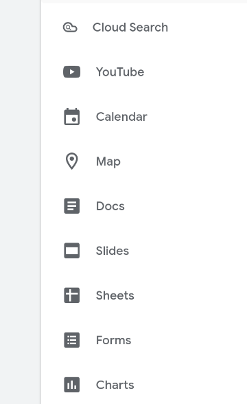
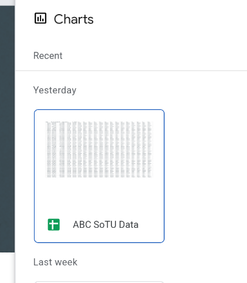
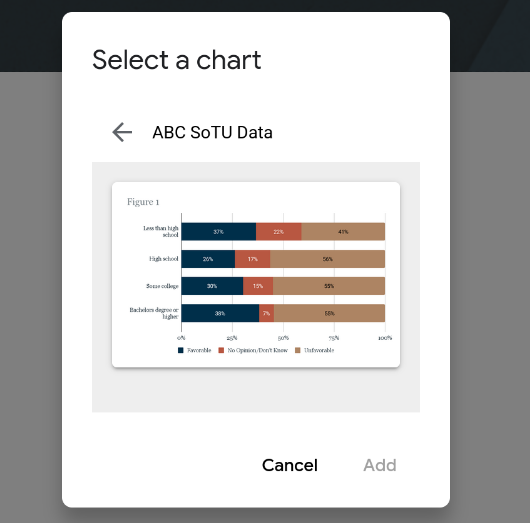
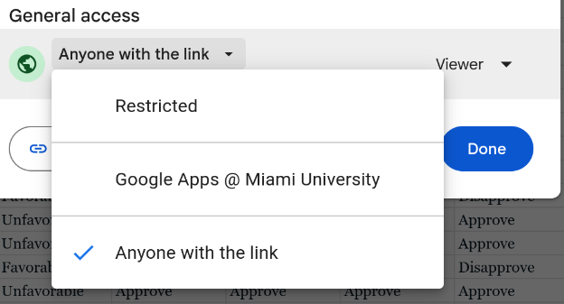
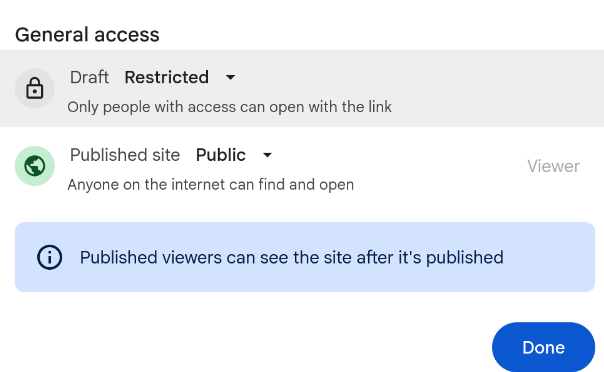

There are two ways to share a chart made in Google Sheets on a Google Site. The most obvious is to select the chart in Google Sheets, copy it, and then paste it into your Google Site. This creates an image of your chart. This generally works but has the problem that if you then update your chart you have to copy it over again (and the resolution of the image can be bad). You can also directly _embed_ the chart from the Google Sheet into your Google Site. This has the benefit of automatically updating if you change the chart and being included in a way that you can change the size of the chart without worrying about resolutions. The problem with this method is that it is slightly tricker and you have to have permissions correct. 

## Embedding the Chart

On the Google Sites editor page you should have a menu on the right. At the very bottom of that menu (@fig-insert) there is the option to insert Charts. Click on that. 

::: {.column-margin}
{#fig-insert}
:::

Once you click that you'll have a popup that lets you select the Google Sheet that has the chart you want to embed (@fig-select). Select the correct Sheet and then you'll get to select which chart to add. If you want to add multiple charts you'll just need to start back over with the insert Chart button. 

::: {#fig-select layout-ncol=2}

{width=90% #fig-select-1}

{width=90% #fig-select-2}

Embedding Chart
:::

## Settings 

The settings are a bit annoying because I'm honestly not positive on what they need to be. The safest thing to do is to set the Google Sheet. to be viewable online by the general public (not just those logged in at Miami). You can then do the same thing for the Google Site. To change the settings for the Google Sheet click on the "Share" button and select the options similar to @fig-settings-1. For the Google Site click Publish on the top right and set the settings similar to @fig-settings-2

::: {#fig-settings layout-ncol=2}

{width=90% #fig-settings-1}

{width=90% #fig-settings-2}

Settings
:::