Making nice-looking tables in Word or Google Docs is relatively simple and generally follows the same basic structure. Here I walk through how to do this in both. In general, it is a lot easier to style and format a table in Microsoft Word than it is in Google Docs (there are also fewer options in Google Docs). The steps below walk you through how I style tables and, more importantly, teach you how to change borders, align columns, merge cells, and insert new rows/columns. 

## Word

### Initial Table Construction 

You can insert a table into your Word document by selecting Insert from the ribbon at the top and then clicking the Table button there. A small window will open, and you can use it to select the number of rows and columns for your table (you can always add or remove rows and columns later on). @fig-word-init shows what this looks like. 

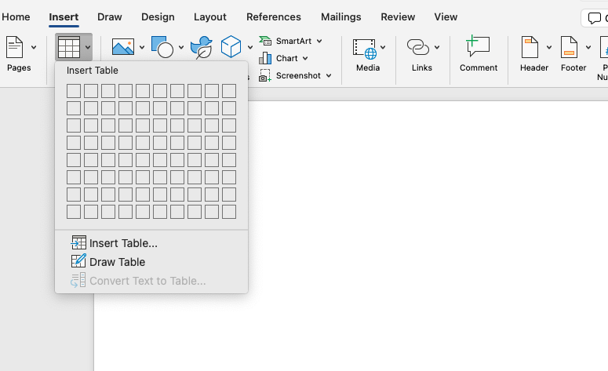{#fig-word-init}

If you want to remove columns or rows once you've created a table, you should highlight that row or column and right-click on it. A menu will pop up and you just need to click Delete Columns to delete the column you've highlighted (@fig-word-remove-cols). 

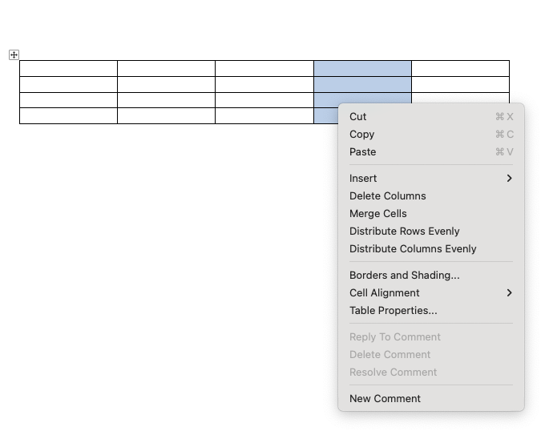{#fig-word-remove-cols}

To insert text into a cell, all you need to do is click on that cell and type whatever you want. If the text you've entered is too long in a cell, it will wrap to another line and expand the height of the row. If you'd prefer to widen the columns instead, you just need to put your mouse over the border between the columns and it will turn into something like: <-|->. If you click, you can then move the column edge back and forth.[^1]

I've trimmed down the initial table to only two columns and filled in the table with some potential survey results (see @fig-word-size). I made up these numbers entirely, so I didn't even check if they add up to 100%. 

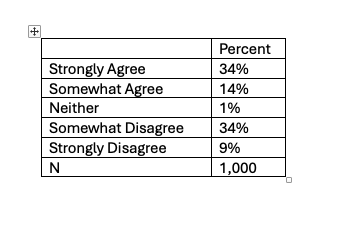{#fig-word-size}

[^1]: If you have highlighted a cell/row, then only the edge of that cell/row will move. 

### Formatting Borders

Borders can be helpful and distracting in tables. The norm for borders is that they shouldn't "clutter" the table, and so should only be used to distinguish separate sections of the table. I always start by removing all the borders and then adding them back in. To remove the borders, highlight the entire table, go to the Table Design tab in the ribbon, and click the borders button. You should see a menu similar to what I have in @fig-word-borders.[^2]

The different checkboxes that appear are relative to what you have selected. So if you have the entire table highlighted and then uncheck "Bottom Border," it will remove the border at the bottom of the table. If you've only highlighted two rows, it will just remove the border at the bottom of the lower row. There are also options for all inside borders and all outside borders. To remove all borders, select "No Borders."

[^2]: If things look different than mine, it might be a result of having the Word window too narrow. As the window narrows, Microsoft Word combines buttons.

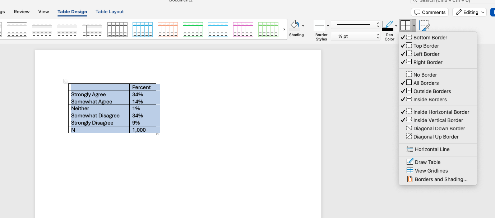{#fig-word-borders}

I then add back in borders to distinguish the header row (currently the first row of the table). To do this, I highlight the first row and select Bottom Border in the border menu. The results look like @fig-word-header. 

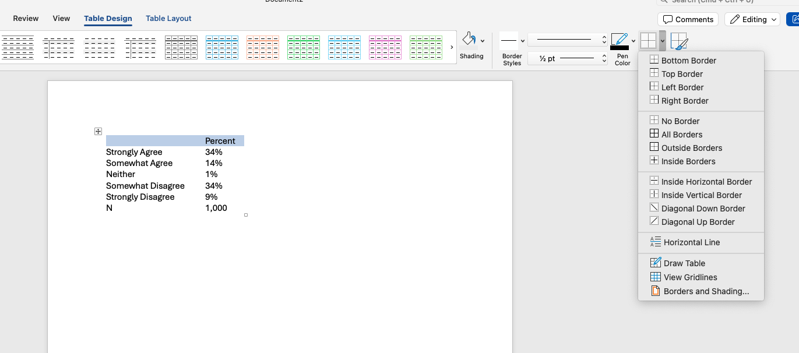{#fig-word-header}

### Aligning Columns/Cells

Another norm (I think) is that labels should be left-aligned (meaning the text starts next to the left edge), while numbers should be center-aligned. Currently, all of our cells are aligned to the left. 

To change the alignment of a cell, all you need to do is highlight it and select the Table Layout button in the ribbon. You should then have a 3-by-3 grid of buttons somewhere in the middle of your menu.[^2] These buttons control horizontal and vertical alignment. To center things entirely, select the center button. You can see the menu in @fig-word-align-cols.

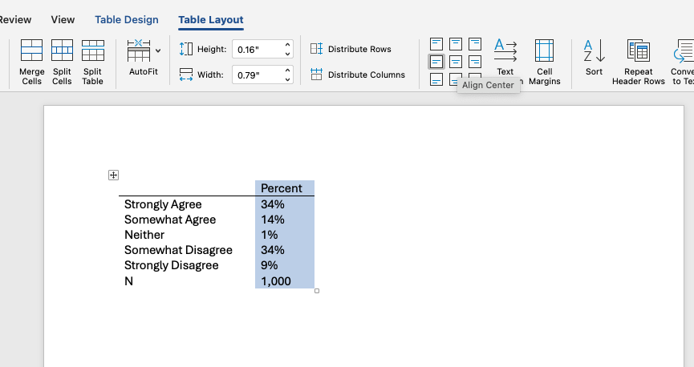{#fig-word-align-cols}

 I also like to right-align the row with the N label to distinguish that this row is not showing a variable label but is instead showing the number of observations. 

### Adding a Caption 

It is common to add a caption or title at the top of a table. Sometimes this is done in the text, but I prefer to have it as part of the table. To do this, though, we need to do a few things. First, we need to add a new row above the header row. We then need to combine the two cells in that row so that we can write all the way across the row. 

To insert a row, you just need to highlight the row below (or above) where you want the row to go. Then right-click on that and, in the menu that pops up, go to "Insert" and select "Rows Above" (or "Rows Below"). See @fig-word-insert. If you highlight multiple rows, it will insert multiple rows (and the same applies for columns). 

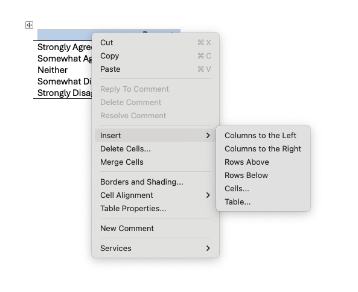{#fig-word-insert}

This will insert a row with two cells. In order to combine them into a single cell, you just need to highlight them both, right-click, and select "Merge Cells" from the menu. 

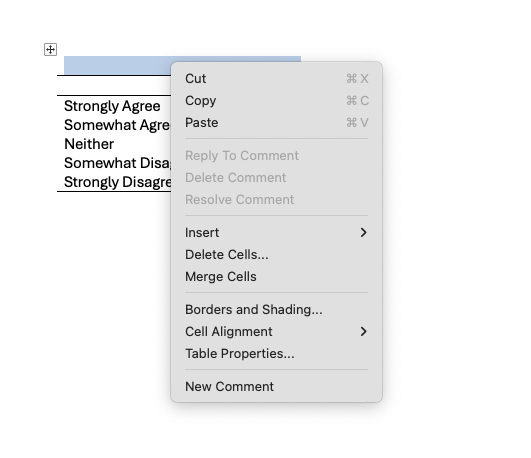{#fig-word-merge}

You can then type a title/caption into that new cell and it will span both columns. In @fig-word-caption, I've added a caption to the table and added borders below it to highlight it. 

Tip: Use a consistent caption style like "Table 1: Descriptive Title" for all tables in an assignment to make it easy to reference them in your text.

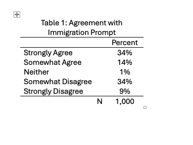{#fig-word-caption}

### Table Note 

It is also common to add notes to the bottom of the table. These notes can clarify what the margin of error is, when the survey was fielded, or other relevant information. You can again do this by inserting a row at the bottom, merging the two cells, and writing a note. If we leave this as is, then the note is distracting. To fix this, we highlight the text there and change the font size just as we would for any other text (see @fig-word-note). 

Tip: Set table notes in a slightly smaller font and consider italics to visually separate them from the main content.

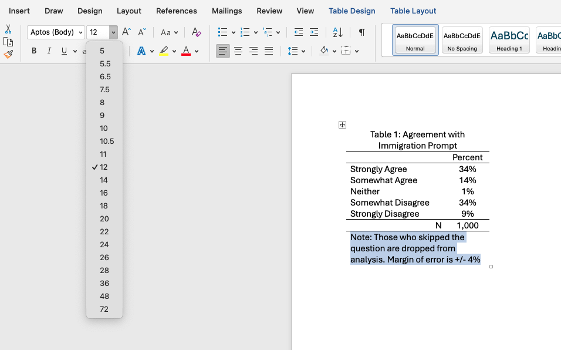{#fig-word-note}

### Aligning Overall Table 

Finally, it is nice to have the table in the center of the page (especially when it is a small table like this). To do that, highlight the entire table (a simple way to do this is by clicking the square button that will show up to the top left of the table if you've clicked inside the table). Then click the normal center-align button you use for text. 

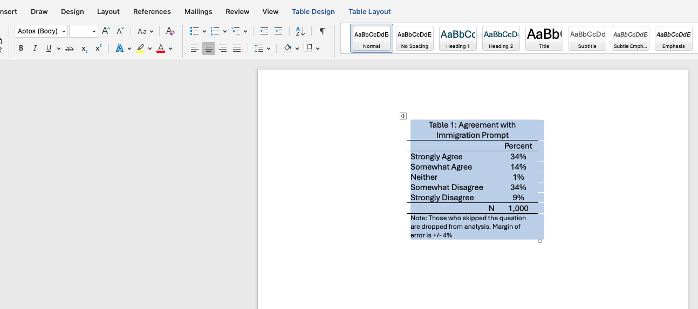{#fig-word-center}

## Google Docs 

### Initial Table Construction 

You can insert a table into your Google Doc by selecting Insert from the top menu and then choosing Table. A small grid will appear that you can use to select the number of rows and columns for your table (you can always add or remove rows and columns later on). @fig-gdoc-init shows what this looks like. 

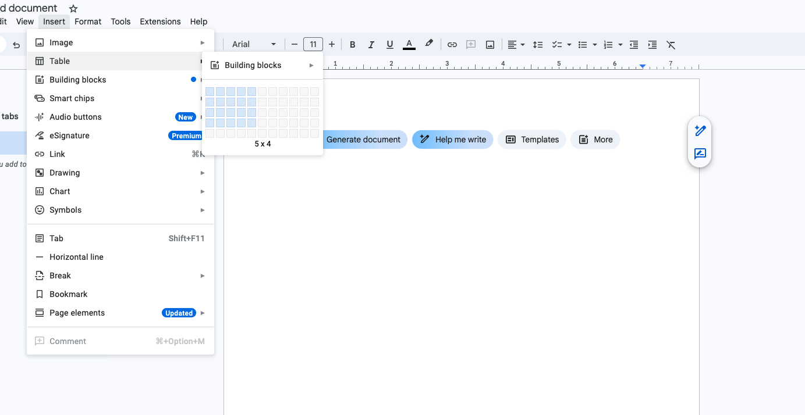{#fig-gdoc-init}

If you want to remove columns or rows once you've created a table, highlight that column or row, right-click, and choose Delete Column or Delete Row. You can also use Insert to add new rows or columns (@fig-gdoc-remove-cols). 

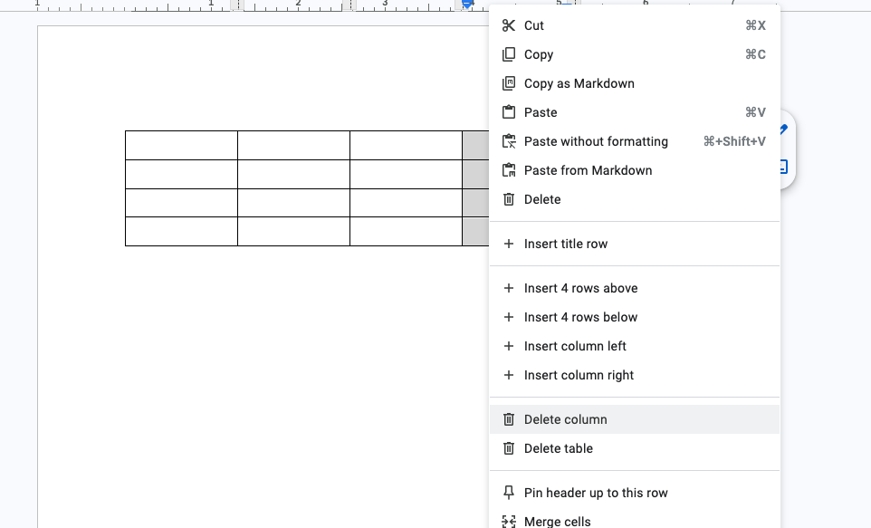{#fig-gdoc-remove-cols}

To insert text into a cell, click on that cell and type. If the text you've entered is too long in a cell, it will wrap to another line and expand the height of the row. If you'd prefer to widen the columns instead, hover over the border between the columns until the cursor changes, then drag to resize (@fig-gdoc-size). You can also set exact sizes via Format → Table → Table properties. 

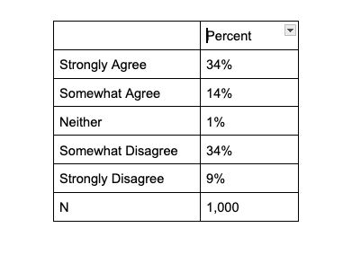{#fig-gdoc-size}

### Formatting Borders

Borders can help readability when used sparingly. In Google Docs, border controls are a little funky. I usually start with minimal borders and then add only what distinguishes sections. With the table (or specific cells) selected, look for a menu button that shows horizontal lines of different thicknesses. This might be hidden, so you will have to select the three-dot button to expand the menu (see @fig-gdoc-borders). Once you have found it, you can set the width of all borders to 0 to start. 

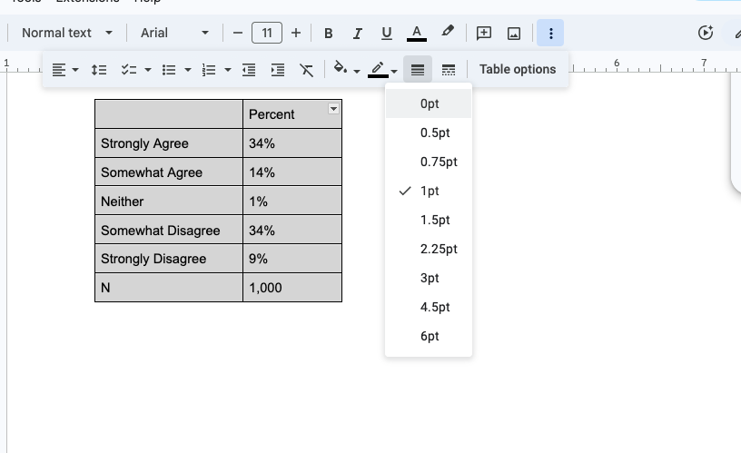{#fig-gdoc-borders}

I then add a bottom border to the header row (the first row of the table) to separate it from the body. To do this, you have to click directly on the border (it will highlight to show you that you've selected it). The border of just one cell will be selected at a time, but you can select more by holding Shift and clicking on additional ones. Once you've selected both borders below the header row, change the width back to 1 pt. This will look like @fig-gdoc-header. 

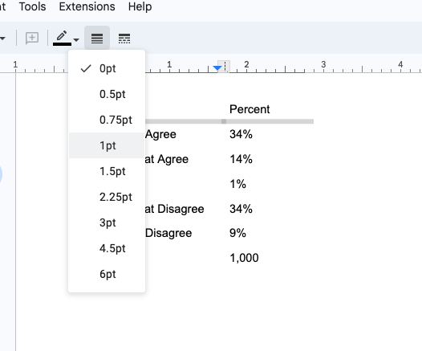{#fig-gdoc-header}

### Aligning Columns/Cells

In general, labels look best left-aligned and numbers center-aligned. Select the cells or columns you want to change and use the horizontal alignment buttons in the toolbar (@fig-gdoc-align-cols). 

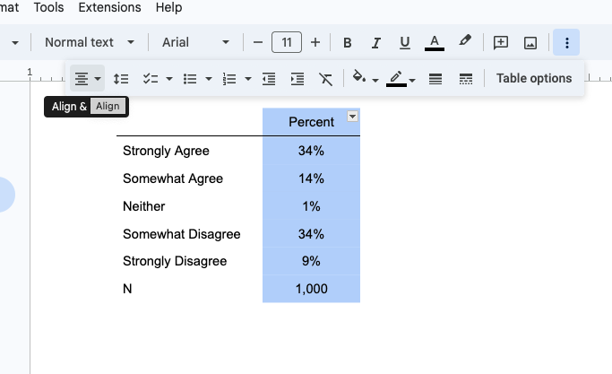{#fig-gdoc-align-cols}

I also like to right-align the row with the N label to distinguish that this row is not showing a variable label but is instead showing the number of observations. 

### Adding a Caption 

To add a caption within the table, insert a new row above the header row, then merge the cells in that row so the caption spans the table width. Right-click and choose Insert row above (@fig-gdoc-insert). 

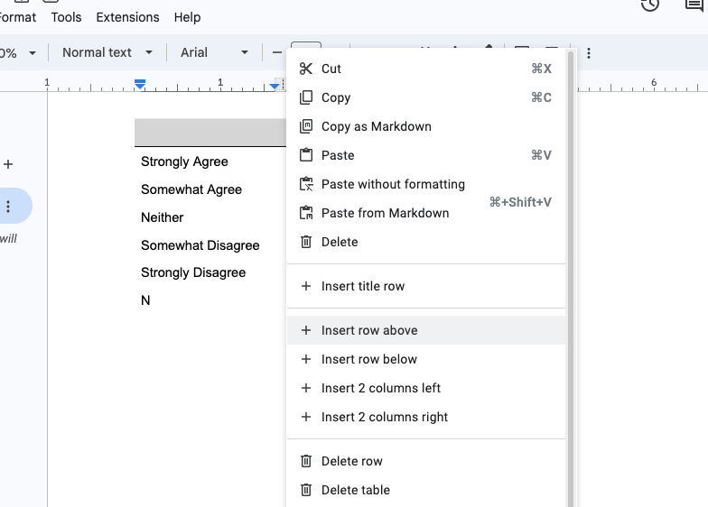{#fig-gdoc-insert}

Then select the two cells and right-click. In the menu, you'll have an option to Merge cells (@fig-gdoc-merge). This will combine them to make a single cell. 

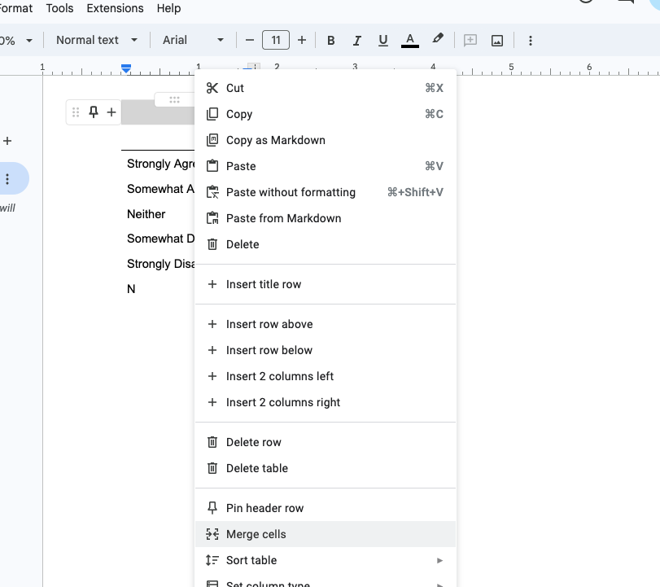{#fig-gdoc-merge}

You can then type a title/caption into that new cell. In @fig-gdoc-caption, I've added a caption and used a bottom border to highlight it. 

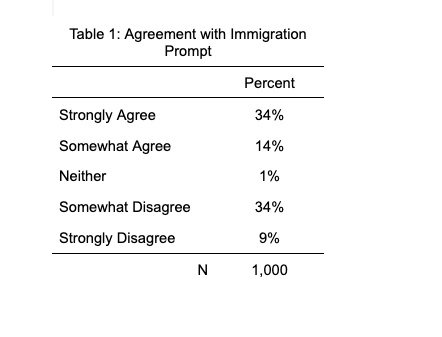{#fig-gdoc-caption}

Tip: Use a consistent caption style like "Table 1: Descriptive Title" across your document for easy referencing.

### Table Note 

It is also common to add notes to the bottom of the table. These notes can clarify what the margin of error is, when the survey was fielded, or other relevant information. You can again do this by inserting a row at the bottom, merging the two cells, and writing a note. If we leave this as is, then the note is distracting. To fix this, we highlight the text there and change the font size just as we would for any other text (@fig-gdoc-note). 

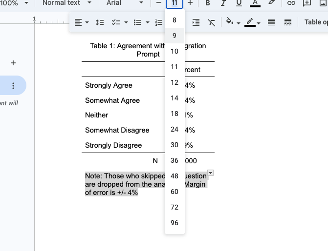{#fig-gdoc-note}

### Aligning Overall Table 

To center the table on the page, right-click anywhere in the table and select "Table options" from the menu that pops up. This will open a menu in the sidebar (@fig-gdoc-center). Under the Table dropdown, there is an option to align the table horizontally and to select how the words move around the table. I like to center it and have text only flow above and below the table (not around it). 

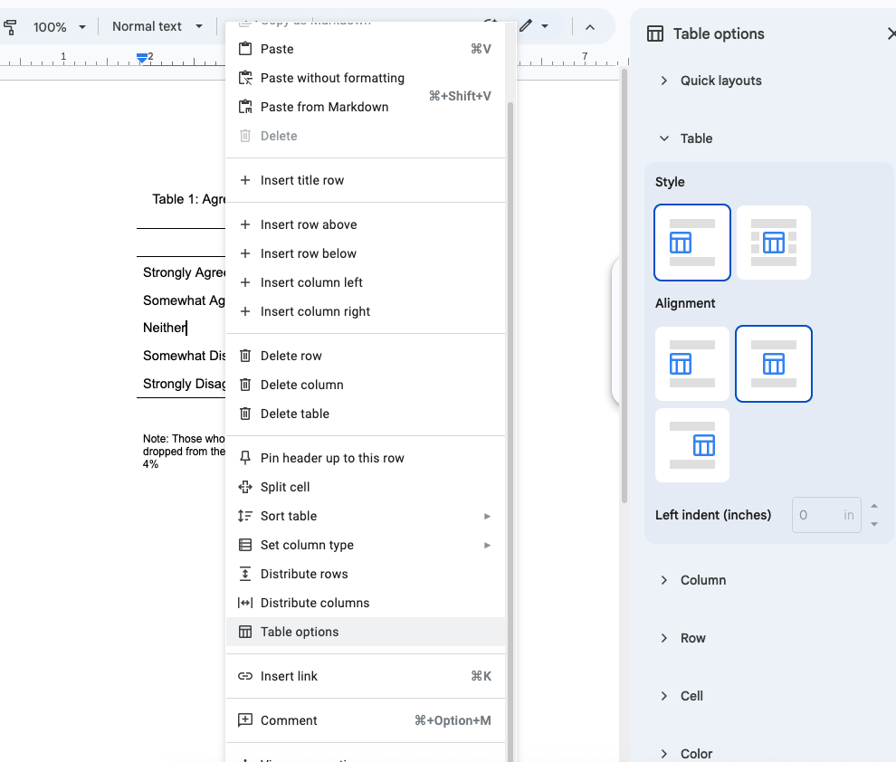{#fig-gdoc-center}
