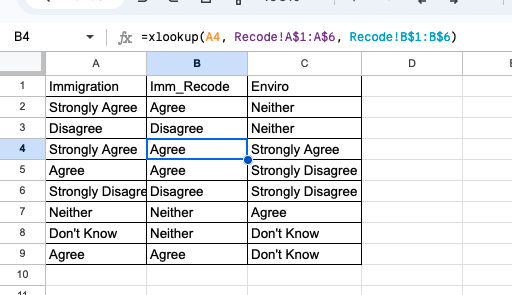
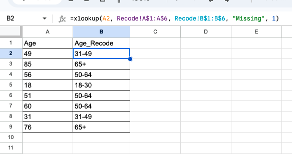

We often need to _recode_ survey data meaning that we want to replace values with a different response. For example, we might have Strongly Agree, Agree, Neither, Disagree, Strongly Disagree and we want to group all the types of Agree into one category and the Disagree into another category. 

There are a variety of ways to do this, and here we are going to learn how to use `xlookup()` in Google Sheets/Excel.


## `xlookup` in general 

`xlooup` is used when you want to fill in information into a cell based on the value in another cell. It follows the [pattern](https://support.google.com/docs/answer/12405947?hl=en):

`XLOOKUP(search_key, lookup_range, result_range, missing_value, match_mode, search_mode)`

The `search_key` will be what you are searching for, the `lookup_range` will be where you are looking **for the search_key**, and the `result_range` will be where it grabs things to return. The `lookup_range` and the `result_range` have to have an equivalent number of rows[^1] so if the `search_key` is found in row 3 of the `lookup_range` then it returns the 3rd row of the `result_range`. 

To make this slightly clearer, @tbl-lookup shows what could be your `result_range` and `lookup_range` for the prompt we started with. The `lookup_range` is in column A, while the `result_range` is in column B. When checking for "Agree", xlookup finds it in `A2` which is the second row of the `lookup_range` and so returns the second row of the `result_range` (`B2`)

```{r}
#| echo: false 
#| tbl-cap: Lookup and Result Range 
#| label: tbl-lookup
library(gt)
library(tibble)

coding_data <- tibble(
    A = c("Strongly Agree", "Agree", "Neither", "Disagree", "Strongly Disagree", "Don't Know"), 
    B = c("Agree", "Agree", "Neither", "Disagree", "Disagree", "Neither")
) 

coding_data |> 
    gt(rownames_to_stub = TRUE) |> 
    tab_style(style = cell_fill(alpha=0.5), locations = cells_column_labels()) |> 
    tab_style(style = cell_fill(alpha=0.5), locations = cells_stub()) |> 
    tab_style(style= cell_borders(color="black"), locations=cells_body())


```

All this means is that in order to use `xlookup` you have to first create a "codebook" table where your lookup and return values are matched in someway. I often like to do this on a different tab of the Google Sheet as to keep the data tab clean.

[^1]: Not true, it could have an equivalent number of columns, but I am simplifying here. 

## Using `xlookup`

In @tbl-example I show what this would look like in practice. Here I assume that @tbl-example-2 is in a second tab of your Google Sheet labeled `Recode`. The formula used is: `=xlookup(A2, RecodeA$1:A$6, RecodeB$1:B$6)`[^2]. If you wanted to do the same recoding process for the Enviro column you just need to change `A2` to `C2` and go from there. 


[^2]: Remember the dollar signs allow you to drag the formula down without changing the values that follow. This makes it easier on you. 

```{r}
#| echo: false 
#| tbl-cap: Example with Code 
#| label: tbl-example
#| layout-nrow: 1
#| layout-ncol: 2
#| tbl-subcap: 
#|    - Survey Data
#|    - Recode 

set.seed(1)
data_example <- tibble(
    A = c("Immigration", sample(coding_data$A, 8, replace=TRUE)), 
    B = c("Imm_Recode", paste0("=xlookup(A", 2:9, ", Recode!A$1:A$6, Recode!B$1:B$6)")),
    C = c("Enviro", sample(coding_data$A, 8, replace=TRUE)),
)
data_example |> 
    gt(rownames_to_stub = TRUE) |> 
    tab_style(style = cell_fill(alpha=0.5), locations = cells_column_labels()) |> 
    tab_style(style = cell_fill(alpha=0.5), locations = cells_stub()) |> 
    tab_style(style= cell_borders(color="black"), locations=cells_body())

coding_data |> 
    gt(rownames_to_stub = TRUE) |> 
    tab_style(style = cell_fill(alpha=0.5), locations = cells_column_labels()) |> 
    tab_style(style = cell_fill(alpha=0.5), locations = cells_stub()) |> 
    tab_style(style= cell_borders(color="black"), locations=cells_body())

```

@fig-recode shows what this would look like on Google Sheets. Again, assuming that you have a second tab. 

{#fig-recode}


### Replacing numbers with categories

In a lot of cases we want to take continuous data and collapse it into categories. For example, you might want to create age buckets out of ages, replacing 41 with "31-49". To do this we need to use the `match_mode` argument mentioned above. 

`match_mode` controls the rules used for matching your data. The default (`0`) will only match if things are exactly the same. We can also set it to `1`, and `-1`. I think the rules for these are a bit hard to parse but here is the language from Google:

>`1` is for an exact match or the next value that is greater than the `search_key`.
>
>`-1` is for an exact match or the next value that is lesser than the `search_key`.

This means that if you select 1, it will search for the `search_key` in your lookup table. If it does not find that exact number it will select the cell that is close to your `search_key` but **greater** than your `search_key`. In @tbl-example-numeric the first age is 49, which is exactly in `A2` of the recoding so it matches with the second row. The second age is 85 which is not in the recode table so the next step is to match with the value that is the next largest number above 85. This is 120 in cell `A4`, and so the fourth row is matched. You should pay attention to this, and always double check with a few known values. 

One final note, in order to set the `match_mode` we also have to set the `missing_value` argument. The `missing_value` argument is simply what it returns when it cannot find the missing value. Below I've used `"Missing"` but this could be anything. 

In total our formula is then: `=xlookup(A2, Recode!A$1:A$6, Recode!B$1:B$6, "Missing", 1)`

```{r}
#| echo: false 
#| tbl-cap: Numeric Example with Code 
#| label: tbl-example-numeric
#| layout-nrow: 1
#| layout-ncol: 2
#| tbl-subcap: 
#|    - Survey Data
#|    - Recode 

coding_data <- tibble(
    A = c(30, 49, 64, 120), 
    B = c("18-30", "31-49", "50-64", "65+")
)

set.seed(1)
data_example <- tibble(
    A = c("Age", 49,sample(18:90, 7, replace=TRUE)), 
    B = c("Age_Recode", paste0("=xlookup(A", 2:9, ", Recode!A$1:A$6, Recode!B$1:B$6, \"Missing\", 1)")),
)
data_example |> 
    gt(rownames_to_stub = TRUE) |> 
    tab_style(style = cell_fill(alpha=0.5), locations = cells_column_labels()) |> 
    tab_style(style = cell_fill(alpha=0.5), locations = cells_stub()) |> 
    tab_style(style= cell_borders(color="black"), locations=cells_body())

coding_data |> 
    gt(rownames_to_stub = TRUE) |> 
    tab_style(style = cell_fill(alpha=0.5), locations = cells_column_labels()) |> 
    tab_style(style = cell_fill(alpha=0.5), locations = cells_stub()) |> 
    tab_style(style= cell_borders(color="black"), locations=cells_body())


```


Again, for those wanting to see this in Google Sheets, @fig-recode-numeric shows it. 

{#fig-recode}


## Things I papered over 

There are a few other things you can do with `xlookup` that aren't useful for this class but are useful in general:

- You can actually have it return _multiple_ cells. To do this you set your results range to have multiple rows. 
- You can flip the orientation entirely and look up across rows instead of cells. The only really important rule here sit hat your lookup range can only be one column OR one row. Here we did one column, and so it assumed that this is the orientation you want to use. 

Finally, `xlookup` is the newer version of `vlookup` and `hlookup` which are very similar but less flexible.
