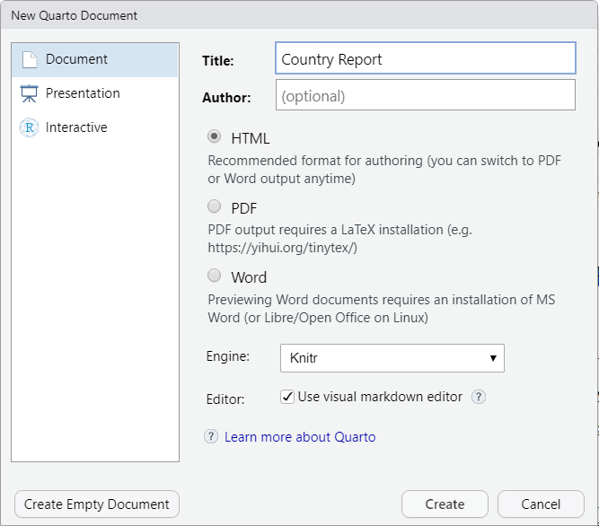

## Goals for Today

- Finish off discussing plots (more on smooths, facetting, etc)
- Basic regression and difference of means
- Using Quarto to create reports. 

# Data for Today 

Today we are going to keep using a subset of country data from [The Quality of Governance Institute](https://www.gu.se/en/quality-government/qog-data).

- Download the [data we'll be using here](images/country_data.csv)
- You can open it with `read_csv()` and if you need more help check out the [first day of slides.](https://kevinreuning.com/presentations/workshops/r_bootcamp/day_1.html)
- There is a description of all the [variables I've included here.](https://kevinreuning.com/presentations/workshops/r_bootcamp/country_data.html) 
- We need the following packages installed: `install.packages(c("tidyverse"))`

```{r}
library(tidyverse)
setwd("images")
df <- read_csv("country_data.csv")
```


# Smooths and Grouping

## Plotting 

Last week we discussed how to make plots in R:

```{r}
#| fig-align: center
p <- ggplot(df, aes(y=van_part, x=mad_gdppc,color=fh_polity2)) + 
    geom_point(size=3) + labs(x="GDP per Capita", y="Voter Participation") + 
    scale_color_gradient2("Democracy", low="purple", 
    high="springgreen4", mid="gray", midpoint=5) + 
    theme_minimal() + scale_x_log10()
p
```


## Showing a trend

`geom_smooth()` can be used to add a trend line to our data. 

```{r}
p + geom_smooth()
```

## Dangers of `geom_smooth()`

`geom_smooth()` is very powerful, but it is easy to have no idea what you are doing with it as defining `trend` is really hard. 

You change the type of trend it makes using the `method=` argument

## Different Smooths - Linear

```{r}
# Linear regression is "lm"
p + geom_smooth(method="lm") 
```

## Different Smooths - Loess line

```{r}
# A local regression line is "loess"
p + geom_smooth(method="loess") 
```

## Different Smooths - Spline

```{r}
# A spline is "gam"
p + geom_smooth(method="gam") 
```

---


::: {.callout-warning}
If you cannot explain what is happening to make that line then you should probably avoid using it. 
:::

## Multiple Smooths

If we have multiple types of observations, we can plot smooths for each one by setting `color=` or `group=` to that variable.


```{.r}
df_new <- df %>% mutate(
    fert_groups = case_when(
            wdi_fertility < 1.9 ~ "Below",
            wdi_fertility < 2.3 ~ "Replacement", 
            wdi_fertility >= 2.3 ~ "Above")) %>%
    group_by(fert_groups) %>% drop_na(fert_groups)
p <- ggplot(df_new, aes(x=bl_asymf, y=mad_gdppc)) + 
    geom_point(size=3)  + 
    labs(y="GDP per Capita", x="Average Schooling") + 
    theme_minimal() + scale_y_log10()  
p + geom_smooth(aes(group=fert_groups)) 
```
::: {.callout-note}
You can use `aes()` in a `geom_*()` if you want to specify something for just that part of the plot.
:::

## Multiple Smooths

```{r}
#| echo: false
df_new <- df %>% mutate(
   fert_groups = case_when(
            wdi_fertility < 1.9 ~ "Below",
            wdi_fertility < 2.3 ~ "Replacement", 
            wdi_fertility >= 2.3 ~ "Above")) %>%
    group_by(fert_groups) %>% drop_na(fert_groups)
p <- ggplot(df_new, aes(x=bl_asymf, y=mad_gdppc)) + 
    geom_point(size=3)  + 
    labs(y="GDP per Capita", x="Average Schooling") + 
    theme_minimal() + scale_y_log10() 
p + geom_smooth(aes(group=fert_groups), method="lm") 
```

## Multiple Smooths Improved

```{r}
#| output-location: slide
df_new <- df %>% mutate(
    fert_groups = cut(wdi_fertility, breaks=c(0, 1.9, 2.3, Inf), 
            labels=c("Below", "Replacement", "Above"))
            ) %>%
    group_by(fert_groups) %>% drop_na(fert_groups)
p <- ggplot(df_new, aes(x=bl_asymf, y=mad_gdppc, color=fert_groups)) + 
    geom_point(size=3)  + 
    labs(y="GDP per Capita", x="Average Schooling") + 
    theme_minimal() + scale_y_log10() + 
    scale_color_brewer("Fertility Rate", type="qual", palette = 2) + 
    geom_smooth(method="lm") 
p 
```


# Facets

## Introduction

Sometimes it is easier to understand the groups if you create individual plots for each group. We call these plots facet and make them with `facet_wrap()` 

To identify what groups to make you put `~variable`. 

## Example

```{r}
# using plot from previous one still. 
p + geom_smooth(method="lm") +
    facet_wrap(~fert_groups)
```

## Check 

Pick two interval variables, and an additional variable that is categorical and binary. Make a scatter plot of the two interval variables and add a smooth, and facet on a variable as well. 

Don't forget labels. 


## Example from Day 1

```{r}
#| echo: true
#| fig-align: center
#| output-location: slide
df %>% 
    mutate(type = cut(fh_polity2,  breaks=c(0, 3, 7, 10), 
                        labels=c("Autocracy", "Anocracy", "Democracy"))) %>% 
    drop_na(type) %>%  
    ggplot(aes(y=wdi_afp, x=mad_gdppc)) + 
    geom_smooth(method="lm", color='black') + 
    geom_point(color='orangered3') + 
    facet_wrap(~type) + 
    scale_x_log10(labels=scales::label_dollar()) +
    theme_minimal() + theme(strip.text=element_text(size=20)) + 
    labs(y="Percent of Labor\nForce in Military", 
    x="GDP per Capita\n(Log scale)") 
```

::: {.fragment .current-only data-code-focus="2-3"}
Mutating our variables
:::

::: {.fragment .current-only data-code-focus="4"}
Dropping variables with missing values
:::

::: {.fragment .current-only data-code-focus="5"}
Setting my `x` and `y` variables
:::

::: {.fragment .current-only data-code-focus="6"}
Creating a linear regression line, in black.
:::

::: {.fragment .current-only data-code-focus="7"}
Scatter plot with nice colors
:::

::: {.fragment .current-only data-code-focus="8"}
Facet on `type`
:::


::: {.fragment .current-only data-code-focus="9"}
Change the x-axis to be logged and make the axis labels nicer.
:::

::: {.fragment .current-only data-code-focus="10"}
Setting the theme up
:::

::: {.fragment .current-only data-code-focus="11-12"}
Labels!
:::


## Additional Help

- References/tutorials: <https://ggplot2.tidyverse.org/>

- Book that discusses principles of data viz and ggplot2: <https://socviz.co/>


# Difference of Means

## t-tests 

The _standard_ way to test if there is a difference in the means of two groups is through a t-test. 

In R there is a function `t.test()` which we can use, but we need our data in the following format: 

| Var 1 | Var 2   |
|-------|---------|
| 13    | Group 1 |
| 3     | Group 1 |
| 5     | Group 2 |

Var 1 is the variable we want to calculate means of, and Var 2 is the variable that indicates the groups. 

## Prepping Data

We are going to use the `br_pvote` variable and replace 1 and 0 with "Yes" and "No" using `case_match()` 

```{r}
new_df <- df %>%
    mutate(Prop_Vote = case_match(br_pvote, 
        1 ~ "Yes", 
        0 ~ "No"))
new_df |> select(Prop_Vote, van_part)
```


## Running t-test 

To run a t-test we write out a formula: `Continuous_Var ~ Grouping_Var` and indicate where the variables are found with `data=`: 

```{r}
t.test(van_part ~ Prop_Vote, data=new_df) 
```

# Regression 

## Linear Regression 

Linear regression relies on the `lm()` (linear model) function. It uses a similar formula/data format: 

`DV ~ IV1 + IV2 + IV3... data=df`

One difference is that we usually want to save the output of our call to `lm()`

## Linear Regression Example 

Lets regress voter participation rate against our variable for indicating proportional voting, average education and fertility rate:

```{r}
mod <- lm(van_part ~ Prop_Vote + bl_asymf + wdi_fertility, data = new_df)
```

## Getting Results 

We use the `summary()` function to extract results from our model

```{r}
summary(mod)
```

## More Things 

There are a few packages we can use to do interesting things with our results: `gtsummary` and `marginaleffects` (`install.packages(c("gtsummary", "marginaleffects", "broom.helpers"))`)

`gtsummary` can be used to make nice tables: 

```{r}
library(gtsummary)
tbl_regression(mod, 
    label=list(Prop_Vote="Prop?", 
        bl_asymf="Education", 
        wdi_fertility="Fertility"), 
    conf.int=FALSE) %>% 
    add_glance_table(include = c(nobs, r.squared))

```

## More Things

`marginaleffects` is useful for plotting predictions with `ggplot` as the output:

```{r}
library(marginaleffects)
plot_predictions(mod, condition="bl_asymf", rug = TRUE)  + 
    theme_minimal() + 
    labs(y="Predicted Voting", x="Education")

```


# Quarto 

## One Document to Rule them All

With Quarto we can do our analysis, write-up the results, and present plots all in a single document. 

This has a few benefits:

- We can easily update the analysis in our final report. 
- You can export the report to a variety of document types. 
- It makes it easy to show how you did what you did. 

Note: This entire presentation is written in Quarto and [available here.](https://github.com/reuning/R-Bootcamp)

## Creating a Quarto Document 

In RStudio go to File $\rightarrow$ New File $\rightarrow$ Quarto Document. You can change the Title and then click **Create**

{fig-align="center"}


## Lay of the Land

There are two ways to edit Quarto files:

- Source: Shows the underlying code. 
- Visual: A modified version of the code that shows what it looks like. 

When you want to see your final document click the  **Render** button with the blue arrow. 

Click it now (it will ask you to save the file, save it where your country data is located). 

## Render Document 

When you Render a document Quarto does a few things:

- It runs the R Code in the blocks. 
- It formats everything in the way you've indicated. 
- It converts it to the final document type (for us an HTML page). 

## Editing Quarto 

Switch to the **Source** version of the document (the button near the top). 

You should see something like:

````` markdown
---
title: "Country Report"
format: html
editor: visual
---

## Quarto

Quarto enables you to weave together content and executable code into a finished document. To learn more about Quarto see <https://quarto.org>.

## Running Code

When you click the **Render** button a document will be generated that includes both content and the output of embedded code. You can embed code like this:

```{{r}}
1 + 1
```

`````

## What is Going On?

````` markdown
---
title: "Country Report"
format: html
editor: visual
---

## Quarto

Quarto enables you to weave together content and executable code into a finished document. To learn more about Quarto see <https://quarto.org>.

## Running Code

When you click the **Render** button a document will be generated that includes both content and the output of embedded code. You can embed code like this:

```{{r}}
1 + 1
```

`````

::: {.fragment .current-only data-code-focus="1-5"}
General Parameters for our document.
:::

::: {.fragment .current-only data-code-focus="7-13"}
Normal every day writing
:::

::: {.fragment .current-only data-code-focus="7,11"}
Headers
:::

::: {.fragment .current-only data-code-focus="15-17"}
R code that we want to run in our document. 
:::


## Lets Make a Document

What do we want to do? 

- We have a plot we made already, lets put that into our Quarto document
- Lets add background information about the data as well and a description of what we find. 

## Code Execution 

Whenever we want to execute code in a Quarto document we surround it with:

```` markdown
```{{r}}
## Run Code Here
```
````

Our code needs to execute without having anything saved, so we need to include both opening the data _and_ making the plot. 

## Opening our Data

If the Quarto document add the code to open the file, remember to load the necessary package as well (if you saved everything in the same folder you don't need to worry about the working directory).

Call the `data` object by itself afterwards as a check, and then render the whole thing. 

. . .

```` markdown
```{{r}}
library(tidyverse)
data <- read_csv("country_data.csv")
data
```
````

## Hiding Stuff

We can modify how the code is executed by adding options at the top of the chunk using `#|`

- Do we want to see the code or not? set with `echo: true` or `echo: false`
- Do we want to see the output for the code or not? set with `output: true` or `output: false`

```` markdown
```{{r}}
#| echo: false
#| output: false 
library(tidyverse)
data <- read_csv("country_data.csv")
data
```
````

Render the document again to see what happens now. 

## Making a Plot 

Now we want to make our plot, we can do that in a new code chunk below the old one. 

Create a new code chunk, and copy and paste the plot you made before to it:

```` markdown
```{{r}}
ggplot(data, aes( .... )) + ...
```
````

You can again, either hide the code using `#| echo: false` but don't change the output. 

## Writing Content Description 


If you want to break up your writeup you can use headers:

``` markdown 
# Biggest Header
## Second Biggest
### Third Biggest
```

## Accessing Variables Outside of Code

You can also access variables from code in your write-up. So lets say you calculate the mean in a code chunk:

```` markdown 
```{{r}}
mean_gdp <- mean(df$mad_gdppc, na.rm=T)
```
````

In your writeup you can access that by calling ```` markdown `r  knitr::inline_expr('mean_gdp') ````:

```` markdown
```{{r}}
mean_gdp <- mean(df$mad_gdppc, na.rm=T)
```

The average GDP in a country is `r  knitr::inline_expr('mean_gdp')` while the maximum is...

````

## Check 

Above the plot, I want you to write a description of the data. You can get that [info here](https://kevinreuning.com/presentations/workshops/r_bootcamp/country_data.html). Make it clear what each variable represents. 

Part of making it clear is incorporating what the mean of your variables are. Calculate the mean of your two interval variables in the R block where you read in the data, and then add that info to your description. 


## Other Formats

You can make a lot of things in Quarto:

- `format: docx` will produce a docx file
- `format: pptx` will produce a powerpoint with each section as a slide
- `format: pdf` will produce a pdf document.
- `format: revealjs` will produce an html presentation like this

Some of these will require installation of additional packages. 


# Summarizing this Week 

## What have we learned? 

- Basics of R, creating variables, manipulating them. 
- Reading in data, modifying variables, calculating statistics on them.
- Making tables using huxtable (you can embed them in a Quarto doc)
- Making plots using ggplot 

## Where to go 

In front of you you likely have a bunch of different R Scripts open right now. 

- Go to your code, look back on it and add comments explaining what it does 
- Save the R Script somewhere (or email it to yourself)

## Learning More 

There is a lot of information online but the best way to learn is to find a project and work through it. 

- Identify a class project or something else that needs data. 
- Figure out what exactly you want to make. 
- Work backwards from there. What data do you need? How do you need to modify it? What things do you need to calculate? 

## Troubleshooting 

What do you do if you run into problems? 

- Check all the variables in the function by themselves.
    - Do they exist? 
    - Do they have all the right columns/info? 
- Check that all your parentheses and quotation marks, do they end? 
- Check that there are commas where there should be.
- Start running through the code piece by piece. 
- Look at the manual and make sure your assumptions about the function are right. 
- Google the error, read Stack Exchange/Stack Overflow